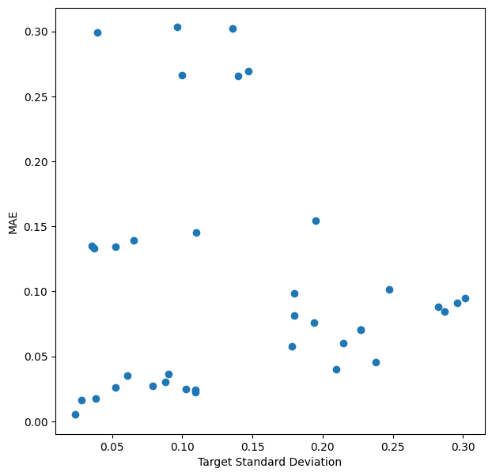
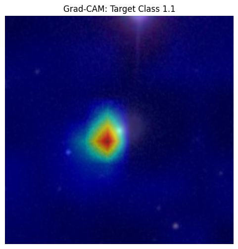
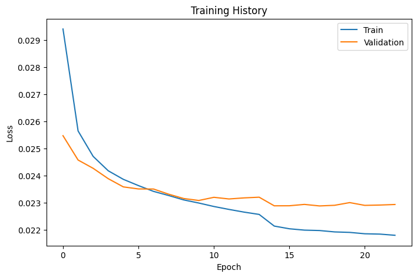

# Galaxy Zoo: Morphology Classification with Conditional Neural Networks

This repository contains a PyTorch-based Deep Learning pipeline designed to classify the morphologies of distant galaxies. It was developed for the [Galaxy Zoo Kaggle Competition](https://www.kaggle.com/c/galaxy-zoo-the-galaxy-challenge).

## Performance
* **Private Leaderboard Score (RMSE):** `0.15116`
* **Public Leaderboard Score (RMSE):** `0.15107`
* **Overfitting Margin:** `< 0.0001`

---

## Architectural Highlights: The "True Tree" Model
Instead of treating this as a standard multi-label classification problem, the architecture explicitly models the dataset's domain logic. The Galaxy Zoo decision tree is highly conditional. 

This model utilizes an **EfficientNet-B3** backbone but completely replaces the final classifier with 11 distinct, sequentially gated output heads. The forward pass mathematically enforces the conditional probabilities of the physical decision tree:

```python
prob_not_edge = out_q2[:, 1:2]
out_q3 = self.q3(features) * prob_not_edge
```

This domain-driven constraint minimizes cascading errors deeper in the decision tree and forces the network to learn hierarchical astrophysical features.

---

## Error Analysis & Interpretability

### 1. Human Ambiguity vs. Model Error
A critical insight from this project is that the model's highest Mean Absolute Error (MAE) correlates directly with the highest Target Standard Deviation. The model successfully learned the inherent ambiguity of deep space.



### 2. Grad-CAM Visualization
To verify the model is learning genuine astrophysical features rather than overfitting to background noise, Grad-CAM was implemented to map the activation gradients. The visual confirms the EfficientNet backbone is correctly attending to the central luminous mass.



### 3. Training Convergence
The model was trained using an `AdamW` optimizer and a `ReduceLROnPlateau` scheduler. The smooth convergence proves a highly stable training pipeline with virtually zero overfitting.



---

## Repository Structure

```text
galaxy-zoo-classifier/
├── src/
│   ├── dataset.py
│   ├── model.py
│   └── predict.py
├── assets/
│   ├── loss_curve.png
│   ├── mae_scatter.png
│   └── grad_cam.png
├── requirements.txt    
└── README.md
```

---

## How to Run Inference

1. Clone the repository and install dependencies:
```bash
git clone [https://github.com/alasaar/galaxy-zoo-classifier.git](https://github.com/alasaar/galaxy-zoo-classifier.git)
cd galaxy-zoo-classifier
pip install -r requirements.txt
```
2. Download the competition dataset from Kaggle and extract the test images into a `data/images_test_rev1/` directory.
3. Place the trained `best_model.pth` file in the root directory.
4. Run the inference script:
```bash
python src/predict.py
```
